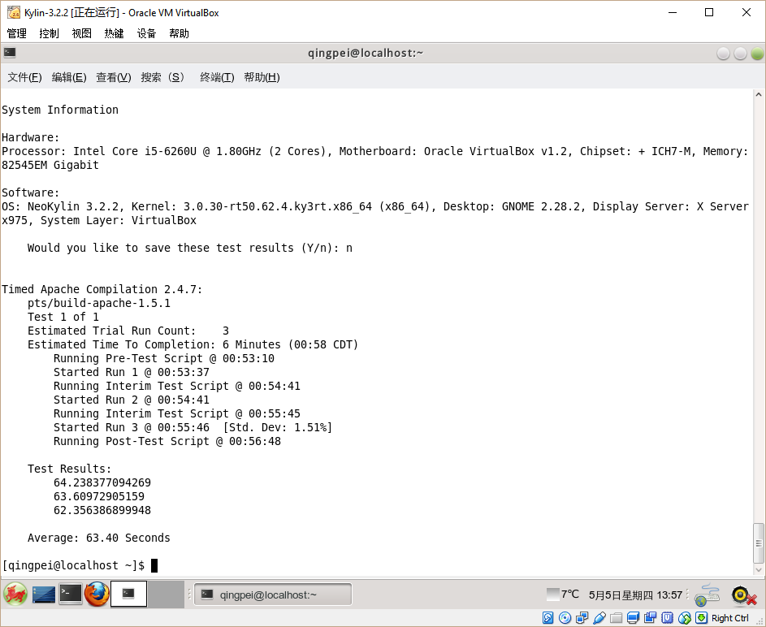

# VirtualBox/VMware Workstation Pro comparison

## Compiler performance

With [Phoronix Test Suite](http://www.phoronix-test-suite.com/), I found the performance difference between VirtualBox and VMware.

In general, VMware is about 10% faster than VirtualBox in terms of compiling software.

