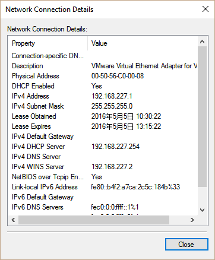

# Installation

A virtual machine is recommended for Qt development under NeoKylin.

You could use [VirtualBox](https://www.virtualbox.org/) (free and open-source) or [VMware Workstation Pro](http://www.vmware.com/products/workstation/workstation-evaluation) (proprietary) as VM host. They are available locally at `\\202.11.4.65\yf1\Software\VirtualBox` and `\\202.11.4.65\yf1\Software\VMware Workstation\`.

The system installation image can be found at `\\202.11.4.65\yf1\OS\NeoKylin\`.

Recommended configuration:

- 2 CPU cores
- 2 GB RAM
- 64 GB HDD
- 1 NIC

## Grant `sudo` privilege to a user

1. Log in as `root`.
2. Run `sudo visudo` in shell.
3. Add a line: `$username ALL=(ALL) NOPASSWD:ALL`
  - You should replace `$username` with the actual username you are using.
  - The `NOPASSWD:ALL` part allows the user to run `sudo` commands without being asked for password. Do this only on your development system. **NEVER DO THIS ON PRODUCTION SYSTEMS.**

## Network Configuration

The GUI configuration tool in control panel is useless. Use the following way to setup a network connection.

### IP configuration

Edit `/etc/sysconfig/network-scripts/ifcfg-eth0`.

#### For VirtualBox

```
DEVICE="eth0"
HWADDR="xx:xx:xx:xx:xx:xx"
NM_CONTROLLED="yes"
ONBOOT="yes"
BOOTPROTO=static
IPADDR=10.0.2.100
GATEWAY=10.0.2.2
NETMASK=255.255.255.0
```

`HWADDR` should be there by default. You do not need to change the detected value.

The default IPv4 range `10.0.x.0/24` comes from Virtualbox documentation. Refer to [online doc](https://www.virtualbox.org/manual/ch09.html#idp46691721314736) for more details.


#### For VMware

Replace `IPADDR` and `GATEWAY` to what you find in host NIC information. For example, when you see the following configuration for your host NIC.



You should set the VM guest configuration to

```
DEVICE="eth0"
HWADDR="xx:xx:xx:xx:xx:xx"
NM_CONTROLLED="yes"
ONBOOT="yes"
BOOTPROTO=static
IPADDR=192.168.227.100
GATEWAY=192.168.227.2
NETMASK=255.255.255.0
```

### DNS configuration

Add nameservers in `/etc/resolve.conf`.

E.g.
```
nameserver 223.5.5.5
nameserver 223.6.6.6
```